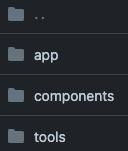
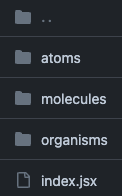
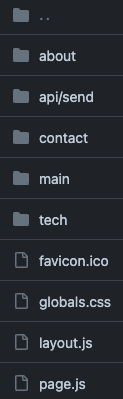

Mini Design Doc
: [Zitao Cai Portfolio's Mini Design Doc
](https://docs.google.com/document/d/1Zn0-Pr0wi5Bllz5X7PDCx_5e11ovmi0s-nUUhwyNaQE/edit)

### Overview/Background

Web Preview: [Zitao Cai Portfolio](https://cztcffsni.github.io/NU-Portfolio-zitao/)

- **Themes:** Two distinct themes are available.
- **Pages:** Includes five distinct pages.
- **Components:** Multiple tools and components are implemented in the components file. They can be called and used within the pages.
- **Structure:** Here is the structure:  

#### Navigation
- **Navbar:** Navigate to different pages via the Navbar. Click the logo at the top left to return to the main front page.
- **Theme Toggle:** Change themes using the toggle at the top right corner.
- **Main Page Button:** Click to view more information.

#### Modes
- **Dark Mode:**  
- **Light Mode:**  

### Technical Problem Statement

1. **Resend Domain Issues:**
   - **Problem:** Using Resend API to send an email in the contact section is stalled because DNS records verification is unusually prolonged.
   - **Temporary Solution:** `<Link mailto:...>` can be an alternative due to the delay in DNS verification.

2. **GitHub Deployment:**
   - **Problem:** Uncertainty about deploying a private repo.
   - **Action Taken:** Opted to create and deploy a public repository instead.

3. **Inconsistency Between Local and Deployed Website:**
   - **Possible Reason:** Differences in the behavior of Next.js locally versus deployed.
   - **Observation:** Displays inconsistent results between the local environment and the deployed site.

4. **Tailwind CSS Rotation:**
   - **Initial Design:** Wanted eight images to circle around a center image in the skill/tech section.
   - **Issue:** The design was not implemented as planned.

### Design Approach

#### Why did you choose to separate out a specific section into a component?
- **Reason for Separation:** Enhances clarity and reusability of components for similar requirements.

#### Why did you keep a state within a component vs using dependency injection?
- **Local State vs. Dependency Injection:** Local state management is utilized for simplicity in a straightforward portfolio project. Dependency injection considered for larger-scale state management across components.

#### Which design patterns did you notice in your app?
- **Module Design Pattern:** By default, the module design pattern is used for components.
- **Structural Patterns:** Notably, the decorator pattern within the app structure.

#### Challenges
- **Resend:** Check the first one in the [Technical Problem Statement](#technical-problem-statement)
 section.
- **GitHub Deployment::** Check the second one in the [Technical Problem Statement](#technical-problem-statement)
 section.

#### CSR, SSR, or Hybrid
- **Hybrid:** For most of my code, I use CSR, because this is a client-side project, and I use a lot of useState and useEffect. Also, because I called the back-end part such as API for the email requirement in the contact section, I also used a small part of SSR.

#### Additional Tools
- **AI Debugging:** Utilized ChatGPT for debugging purposes.