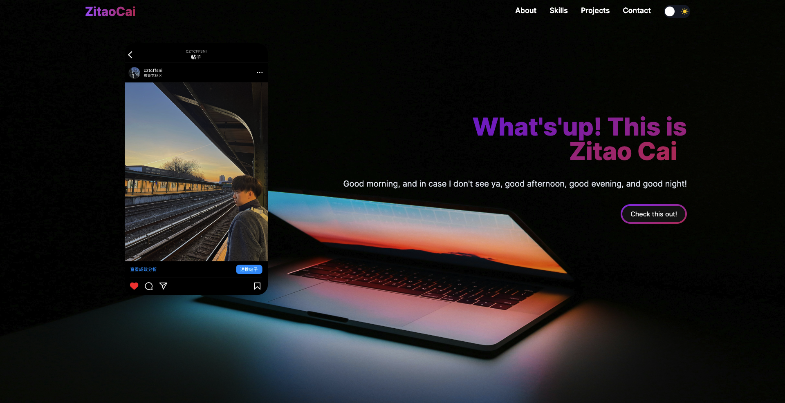

Mini Design Doc
: [Zitao Cai Portfolio's Mini Design Doc
](https://docs.google.com/document/d/1Zn0-Pr0wi5Bllz5X7PDCx_5e11ovmi0s-nUUhwyNaQE/edit)

### Overview/Background

Web Preview: [Zitao Cai Portfolio](https://cztcffsni.github.io/NU-Portfolio-zitao/)

- **Themes:** Two distinct themes are available.
- **Pages:** Includes five distinct pages.
- **Components:** Multiple tools and components are implemented in the components file. They can be called and used within the pages.
- **Architecture:** I use the the Atomic Design Methodology:    
- **Structure:** Here is the structure in /app:   

#### Navigation
- **Header:** Navigate to different pages via the Navbar. Click the logo at the top left to return to the main front page.
- **Theme Toggle:** Change themes using the toggle at the top right corner.
- **Main Page Button:** Click to view more information.

#### Modes
- **Dark Mode:**  
- **Light Mode:**  

### Technical Problem Statement

1. **Resend Domain Issues:**
   - **Problem:** Using Resend API to send an email in the contact section is stalled because DNS records verification is unusually prolonged.
   - **Temporary Solution:** `<Link mailto:...>` can be an alternative due to the delay in DNS verification.

2. **GitHub Deployment:**
   - **Problem:** Uncertainty about deploying a private repo.
   - **Action Taken:** Opted to create and deploy a public repository instead.

3. **Inconsistency Between Local and Deployed Website:**
   - **Possible Reason:** Differences in the behavior of Next.js locally versus deployed.
   - **Observation:** Displays inconsistent results between the local environment and the deployed site.

4. **Tailwind CSS Rotation:**
   - **Initial Design:** Wanted eight images to circle around a center image in the skill/tech section.
   - **Issue:** The design was not implemented as planned.
   -  

### Design Approach

#### Why did you choose to separate out a specific section into a component?
- **Modularity and Independence:** Components allow each part to be tested and used independently, which simplifies maintenance and updating.
- **Code Organization and Clarity:** A well-organized component structure improves code organization and clarity, making it easier to add new features without breaking existing functionality.
- **Performance and User Experience:** Optimizes performance and enhances user experience by ensuring stable functionality across updates.
- **Productivity:** Using the Atomic Design Methodology reduces development time and increases productivity through clear, systematic management of complex interfaces.

#### Why did you keep a state within a component vs using dependency injection?
- **Simplicity in State Management:** For a simple portfolio project, keeping a state within a component reduces the complexity and overhead associated with tools like dependency injection.
- **Component Self-Containment:** State maintained within a component simplifies updates and maintenance, allowing for more focused testing and quicker iterations.
- **Clear Organizational Structure:** Internal state management promotes a clearer, more organized codebase.

#### Which design patterns did you notice in your app?
- **Module Design Pattern:** Utilized for component-based architecture, enhancing modularity and reuse.

#### Challenges
- **Resend Domain:** Initially intended to use a Resend API for email sending, but due to backend issues, switched to a simpler `<Link mailto:...>` approach, bypassing backend dependencies.
- **GitHub Deployment::** Check the second one in [Technical Problem Statement](#technical-problem-statement).

#### CSR, SSR, or Hybrid
- **Hybrid:**
  - **CSR:** Used for most of the portfolio to enhance interactivity and responsiveness, where JavaScript runs in the user's browser to dynamically generate content.
  - **SSR:** Employed for the email-sending feature on the contact page to handle server-side functionalities like mail delivery.

#### Additional Tools
- **AI Debugging:** Utilized ChatGPT for debugging purposes.
